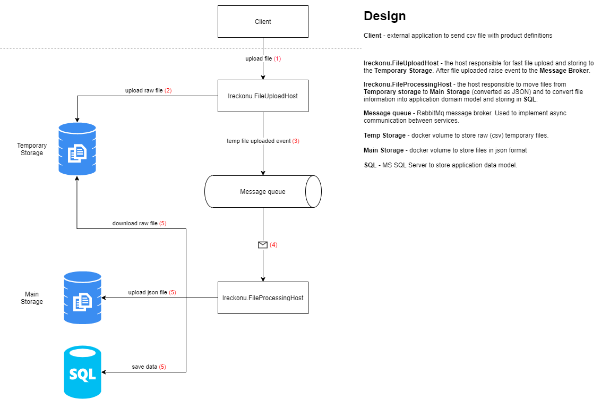

# Ireckonu Assessment
Ireckonu Assessment is an implementation of .NET Software Engineer Technical Assignment task. [html](docs/assessment.md)
**The assessmetn is not that obvious** so additional definitions are **[here](docs/assessment-definition.md)**

## High level design 

## Prerequisites
* docker 
* docker-compose
* .NET Core SDK 3.1
* PowerShell

## How to run application without Visual Studio
 * Just run **_start.bat** script
 * Grab url for **questionnairehost** container and open in the browser
 * Enjoy!
 
## Tech Stack
 * [ASP.NET Core](https://docs.microsoft.com/en-us/aspnet/core/?view=aspnetcore-3.1)
 * [Docker](https://www.docker.com/)
 * [Cake Build](https://cakebuild.net/)
 * [NUnit](https://nunit.org/)
 * [MediatR](https://github.com/jbogard/MediatR)
 * [AutoMapper](https://automapper.org/)
 * [Newtonsoft Json](https://www.newtonsoft.com/json)
 * [Drawio](https://draw.io/)

## Principles:
 * SOLID
 * Clean Arhitecture
 * CQRS
 * Feature Folders
 * TDD

## Ideas

# License

Ireckonu Assessment is open source software, licensed under the terms of MIT license. 
See [LICENSE](LICENSE) for details.
